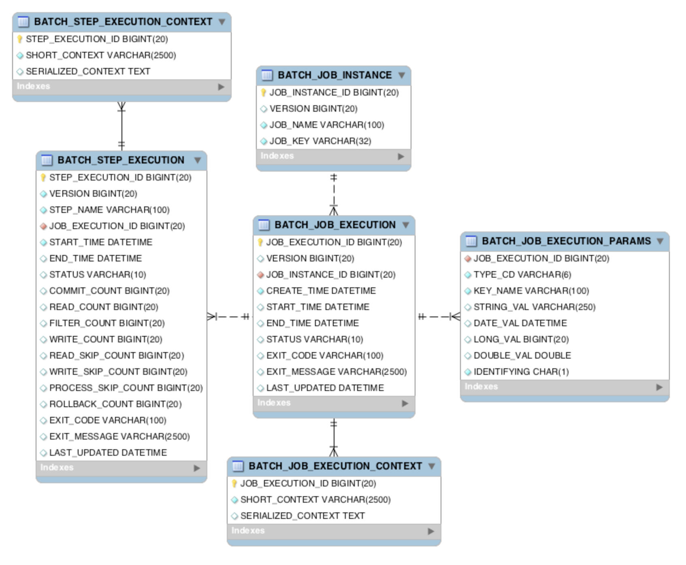
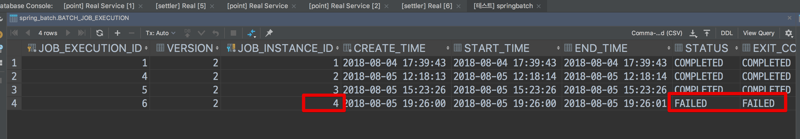
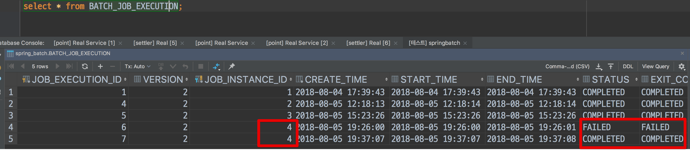
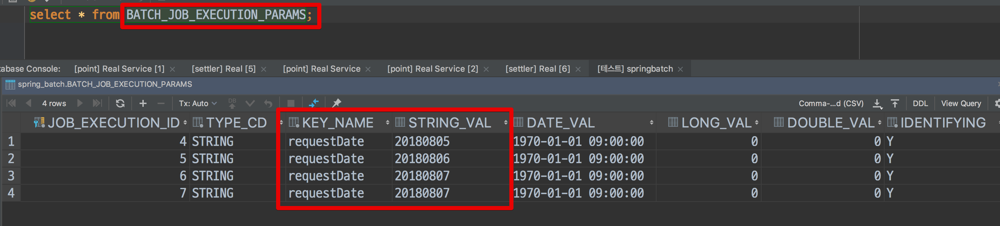

# springBootStudy

### Batch란?

- 배치(Batch)는 일괄처리 란 뜻을 갖고 있으며 일괄처리 모듈이라 보면 된다.
- 대량의 데이터 집계 및 통계 처리에 사용된다.
- Batch + 스케줄러로 합쳐서 사용된다.
- 정해진 시간마다 데이터 가공이 필요한 경우에 어디서든 Spring Batch가 사용될 수 있다.
<br/>
<hr/>

### 사용 이유?
- 웹 서버에서 대량의 데이터를 집계 및 통계 와 같은 일괄 처리를 하게되면 웹의 Request, Response를 할 수 없게된다.
- 집계가 하루에 단 1번 수행 되는데 이것을 WebApplication으로 만드는 것 자체도 개발 시간 낭비이다.
- 집계 중간에 실패 시 (총 10만번 의 실행이 필요한 상태) 다시 처음부터 하기에는 비효율적임
- 이미 한번 실행된 Batch는 다시 실행되지 않기에 중복 집계를 방지 할 수 있음

### 사용 사례
- 일매출 집계 : 하루 거래건 50 ~ 100만 일경우 해당 거래 통계를 집계쿼리로 직접 조회하려면 조회 시간이나 서버의 부하가 심해지는데 이러한 경우 전날 새벽 배치를 통해 집계 데이터를 생성 한 후
해당 데이터를 확인 하는 용도로 사용
- ERP 연동 : 매일 매출 현관 이나 통계, 이력 자료를 배치를 통해 필요한 집계를 만들어 낸 후 해당 데이터를 DB에 적재 후 사용

#### ✅ 요약
웹 어플리케이션을 개발할때 비지니스 로직에 최대한 집중 할 수 있도록 Spring을 사용하는 것 처럼 Batch 개발시 비즈니스 로직에 집중 할 수있도록   
지원하는 모듈이 SpringBatch 이다. 

<br/>
<hr/>

### Batch Application 조건
- **대량 데이터** : 배치 어플리케이션은 대량의 데이;터를 가져오거나, 전달하거나 ,계산하는 등의 처리를 할 수 있어야한다.
- **자동화** : 배치 어플리케이션은 심각한 문제를 제외 하고는 사용자 개입 없이 실행되어야 한다.
- **견고성** : 배치 어플리케여슨은 잘못된 데이터를 충돌/중단 없이 처리할 수 있어야한다.
- **신뢰성** : 배치 어플리케이션은 무것이 잘못되었는지 추적할 수 있어야 한다.
- **성능** : 배치 어플리케이션은 지정한 시간 안에 처리를 완료하거나 동시에 실행되는 다른 어플리케이션을 방해하지 않도록 수행 되어야한다.

<br/>
<hr/>

### Batch 지원 Reader & Writer

- iBatis 모듈은 현재 삭제된 상태

|DataSource|기술|설명|
|---|---|---|
|Database|JDBC|페이징, 커서, 일괄 업데이트 등 사용 가능|
|Database|Hibernate|페이징, 커서 사용 가능|
|Database|JPA|페이징 사용 가능 (현재 버전에선 커서 없음)|
|File|Flat file|지정한 구분자로 파싱 지원|
|File|XML|XML 파싱 지원|


<br/>
<hr/>

### Batch 와 스케줄러(Quartz) 차이

- 스케줄러 : 설정 주기에 맞춰 반복해서 실행 하는 것
- 배치 : 대용량의 데이터를 처리하는 기능을 갖고 있음

#### ✅ 요약
배치 와 스케줄러는 비교 대상이 아니며 배치를 사용할 때는 해당 배치를 실행 시켜줄 때 스케줄러를 사용한다 보면 된다.  
대량의 데이터 처리를 위한 어플리케이션이 필요할 경우에는 Batch를 사용하고, 가벼운 주기적으로 실행될 가벼운 로직 같은 경우는  
Quartz를 사용해 스케줄링을 사용해 주자.


<br/>
<hr/>


### Spring Batch 사용 - Simple 예제 

- 1 ) Dependencies 추가
  - DB (사용할 DB를 지정 - H2 Database 사용시 자동으로 Batch 스키마 Table을 생성해 줌)
  - JPA ( Mybatis 중 선택 가능 )
  - Lombok
  - Batch
```groovy
// build.gradle

dependencies {
	implementation 'org.springframework.boot:spring-boot-starter-batch'
	implementation 'org.springframework.boot:spring-boot-starter-data-jpa'
	compileOnly 'org.projectlombok:lombok'
	runtimeOnly 'org.mariadb.jdbc:mariadb-java-client'
	annotationProcessor 'org.projectlombok:lombok'
	testImplementation 'org.springframework.boot:spring-boot-starter-test'
	testImplementation 'org.springframework.batch:spring-batch-test'
}
```

- 2 ) `projectName`Application에 Batch 사용 선언
```java
// "Project"Application

@SpringBootApplication
@EnableBatchProcessing  // ✅ batch를 사용하기 위해 "필수" 선언 [ Batch 기능 활성화 ]
public class BatchStudyApplication {
    public static void main(String[] args) {
        SpringApplication.run(BatchStudyApplication.class, args);
    }
}
```

- 3 ) JPA 설정 및 DB 연결 설정
  - 간단한 방법이기에 Code Skip

- 4 ) Job, Step 생성 
  - BeanFactory 등록을 위한 `@COnfiguration` 추가
  - Batch에 사용될 Job 과 Step을 생성 해줄 DI 주입
    - `@RequiredArgsConstructor` 어노테이션 추가 
    - `JobBuilderFactory` Job 생성 Class 추가
    - `StepBuilderFactory` Step 새성 Class 추가 
```java
// SimpleJobConfiguration 

@Log4j2
@RequiredArgsConstructor
@Configuration
public class SimpleJobConfiguration {

    private final JobBuilderFactory jobBuilderFactory;
    private final StepBuilderFactory stepBuilderFactory;

    // Job 생성
    @Bean
    public Job customSimpleJob() {
        return jobBuilderFactory.get("job1")    // ✅ 해당 이름으로 Job 생성            
                .start(customSimpleStep1())     // ✅ 시작 시 사용 될 Step 주입
                .build();
    }

    // Step 생성
    @Bean
    public Step customSimpleStep1(){
        return stepBuilderFactory.get("step2")              // ✅ 해당 이름으로 Step 생성
                .tasklet((contribution, chunkContext)->{    // 해당 Step 해서 수행될 기능 정의
                    log.info(">>>> THis is Step1");
                    return RepeatStatus.FINISHED;
                }).build();
    }

}
```

- 5 ) 실행 
  - ❌ Exception 발생 ( Message :: `spring_batch_BATCH_JOB_INSTANCE dosen't exist` )
    - 원인 : Spring Batch의 경우 중간에 문제가 겼을 경우 정지 된 부분 부터 재실행 및 중복 실행 방지를 위해 이력을 저장할 Meta Table이 필요하다
    - 해결 방법 : Meta Table 추가해준다.
      - 파일 찾기를 통해 `schema-사용DB.sql`을 찾은 후 해당 Create Query를 사용
      - 또는 해당 파일 위치를 서버 기동시 읽을 수 있게 sql-script를 사용해 주자
  - 👍 Meta Schema Table 생성 후 서버를 구동하면 정상적으로 배치가 실행된다.
    - 단 ! 한번 더 실행 시 중복 Job 실행으로  Error 발생
      - Error Message : `Duplicate entry '0' for key 'PRIMARY'`
  - ☠️☠️☠️☠️☠️☠️☠️☠️☠️☠️☠️☠️☠️☠️
  - 긴급 추가 [ 이걸로 삽질 2시간 함.. ]
  - ☠️☠️☠️☠️☠️☠️☠️☠️☠️☠️☠️☠️☠️☠️
    - SpringBoot 2.X 버전 사용시 위에서 제공해주는 쿼리 그대로 사용하면 시퀀스 값이 오르지 않는 문제 발생..
      - 해결 방법 - 해당 sql 파일에서 제공해주는 시퀀스에 생성해주는 insert 쿼리를 다른것을 사용하자
        - 사용 ❌
          - `INSERT INTO BATCH_STEP_EXECUTION_SEQ (ID, UNIQUE_KEY) select * from (select 0 as ID, '0' as UNIQUE_KEY) as tmp where not exists(select * from BATCH_STEP_EXECUTION_SEQ);`
          - `INSERT INTO BATCH_JOB_EXECUTION_SEQ (ID, UNIQUE_KEY) select * from (select 0 as ID, '0' as UNIQUE_KEY) as tmp where not exists(select * from BATCH_JOB_EXECUTION_SEQ);`
          - `INSERT INTO BATCH_JOB_SEQ (ID, UNIQUE_KEY) select * from (select 0 as ID, '0' as UNIQUE_KEY) as tmp where not exists(select * from BATCH_JOB_SEQ);`
        - 변경 👍
          - `INSERT INTO BATCH_STEP_EXECUTION_SEQ values(0, '0');`
          - `INSERT INTO BATCH_JOB_EXECUTION_SEQ values(0, '0');`
          - `INSERT INTO BATCH_JOB_SEQ values(0, '0');`
<br/>
<hr/>

### Job의 구조

- 하나의 Job은 여러개의 Step을 갖을 수 있다.
- Step에서의 사용 방식에는 2가지 방법 있다
  - Tasklet 방식
    - 사용자의 커스텀 방식대로 진행 되는 방식
  - Reader -> Processor -> Writer 방식
    - DB를 읽고 로직 사용 후 OutPut을 정의 하는 방식

<image src="https://t1.daumcdn.net/cfile/tistory/99E8E3425B66BA2713" />

<br/>
<hr/>

### Batch Meta Table

- **`ERD`** 구조



- 1 ) **BATCH_JOB_INSTANCE**
  - 실행 되었던 `Job Parameter`에 따라 생성되는 테이블이다.
    - 여기서 `Job Parameter`란 ?
      - Spring Batch가 실행도리 때 `외부`에서 받을 수 있는 파라미터 이다.
      - 특정 날짜를 Job Parameter로 넘기면 Spring Batch에서는 해당 날짜 데이터로 Batch 작업을 진행 할 수있다.
      - 같은 Job이라도 `Job Parameter가 "다르면" BATCH_JOB_INSTANCE`에 기록 된다.
  - 적용 Code
    - `@JobScope`를 사용해서 jobParameter를 변경 할 수 있게 함
    - `@Value("#{jobParameters[requestDate]}"`를 사용해 파라미터를 변경함
      - 여기서 `requestDate` 값은 Argument Parameter에서 받아옴
  - **결과 정리**
    - `BATCH_JOB_INSTANCE`테이블을 확인해 보면 `JOB_NAME`은 같아도 상관 없이 저장이 가능하지만 `Job Parameter`는 같으면 ***에러가 발생한다.*** 
```java
// SimpleJobConfiguration


public class SimpleJobConfiguration {

  private final JobBuilderFactory jobBuilderFactory;
  private final StepBuilderFactory stepBuilderFactory;

  @Bean
  public Job simpleJob() {
    return jobBuilderFactory.get("simpleJob")
            .start(simpleStep1(null))
            .build();
  }

  /**
   * jobParameters의 값이 이미 DB에 저장되어 있을 경우 실행 X
   * */
  @Bean
  @JobScope // ✅ 중요
  public Step simpleStep1(@Value("#{jobParameters[requestDate]}") String requestDate){
    return stepBuilderFactory.get("simpleStep1")
            .tasklet((contribution, chunkContext)->{
              log.info(">>>> THis is Step1");
              // 👉 받아온 jobParameters 출력
              log.info(">>>>>>>>>>>>> requestDate = {}",requestDate);
              return RepeatStatus.FINISHED;
            }).build();
  }

}
```


- 2 ) **BATCH_JOB_EXECUTION**
  - `BATCH_JOB_INSTANCE`와 부모-자식 관계이다.
  - `BATCH_JOB_INSTANCE`(부모)가 성공/실패했던 모든 내역을 갖고 있다.
    - 👉 중복된 Job Parameter로 인한 실패는 저장하지 않음
    - 실행 중 실패해야 저장된다.
  - 강제 Exception 발생 Code
    - Step을 한개 늘린 후 Step1에서 강제 Exception 발생
      - Error Message : `java.lang.IllegalArgumentException: Step 1에서 강제 에러 발생`
  - **결과 정리**
    - 실패 시 실패 상태로 저장된다. 
      - ✅ 실패한 `Job Parameter`로 2번 실행했는데 같은 파라미터로 실행되었다는 **에러가 발생하지 않았다**
    - Spring Batch는 동일한 `Job Parameter`로 **성공한 기록이 있을때만 재수행**이 안된다는 것을 알 수 있다.
      - 👉 예외를 발생 시키지 않는 코드로 작성시 `Status`가 `Completed`로 저장됨.

```java
// SimpleJobConfiguration

@Log4j2
@RequiredArgsConstructor
@Configuration
public class SimpleJobConfiguration {

  private final JobBuilderFactory jobBuilderFactory;
  private final StepBuilderFactory stepBuilderFactory;

  @Bean
  public Job simpleJob() {
    return jobBuilderFactory.get("simpleJob")
            .start(simpleStep1(null))
            .next(simpleStep2(null))    // 👉 Step1 끝난 후 다음 Step - 단 실행 되지 않음 ❌
            .build();
  }

  @Bean
  @JobScope
  public Step simpleStep1(@Value("#{jobParameters[requestDate]}") String requestDate){
    return stepBuilderFactory.get("simpleStep1")
            .tasklet((contribution, chunkContext)->{
              // ☠️ 강제 예외 발생  
              throw new IllegalArgumentException("Step 1에서 강제 에러 발생");
            }).build();
  }

  // ☠️ 해당 Step은 실행되지 않음
  @Bean
  @JobScope
  public Step simpleStep2(@Value("#{jobParameters[requestDate]}") String requestDate){
    return stepBuilderFactory.get("simpleStep2")
            .tasklet((contribution, chunkContext)->{
              log.info(">>>> THis is Step2");
              log.info(">>>>>>>>>>>>> requestDate = {}",requestDate); 
              return RepeatStatus.FINISHED;
            }).build();
  }
}
```

#### 💬 해당 예외로 인해 "FAILED"로 저장 `Status` 컬럼에 주목!


#### 💬 성공적으로 완료 시 "COMPLETED"로 저장 `Status` 컬럼에 주목!


- 3 ) **BATCH_JOB_EXECUTION_PARAM**
  - `BATCH_JOB_EXECTUTION`는 생성 될 당시 입력 받은 `Key값` 과 `Job Parameter`를 갖고 있다.




<br/>
<hr/>

### Next

- Job 에서 진행될 Step들을 연결할 때 사용된다.

👉 ↓ 아래 코드를 Job Parameter를 수정 후 실행 시 이전에 작성한  Batch도 같이 실행된다는 문제가 있다.
```java
// StepNextJobConfig

@Log4j2
@Configuration
@RequiredArgsConstructor
public class StepNextJobConfig {

  private final JobBuilderFactory jobBuilderFactory;
  private final StepBuilderFactory stepBuilderFactory;

  @Bean
  public Job stepNextJob(){
    return jobBuilderFactory.get("stepNextJob")
            .start(step1())
            .next(step2())
            .next(step3())
            .build();
  }
  
  // 아래와 같은 코드를 스텝별로 있음
  @Bean
  public Step step1(){
    return stepBuilderFactory.get("step1")
            .tasklet(((contribution, chunkContext) -> {
              log.info(">>>> THis is Step1");
              return RepeatStatus.FINISHED;
            })).build();
  }

}
```

👉 지정한 Batch Job만 실행하는 방법
- 문제
  - 현재 문제점은 Job parameter를 넣고 실행 시키면 다른 배치도 같이 진행 된다는 문제가 발생
- 해결방법
  - application.properties에 `spring.batch.job.names = ${job.name:NONE}` 설정을 추가하여 `job`이름까지 Argument parameter로 받아 실행
  - Argument Parameter 예시 `--job.name=stepNextJob version=???`
    - job.name은 내가 실행하고자 하는 `Job Name`과 맞춰줘야한다.

```properties
# application.properties

# Batch 이름 설정
## - Spring Batch가 실행 시, Program arguments로 job.name 값이 넘어오면 해당 값과 일치하는 Job만 실행
## - NONE이 할당되면 어떤 배치도 실행하지 않겠다는 의미입니다.
spring.batch.job.names = ${job.name:NONE}
```

<br/>
<hr/>

### Batch Step 흐름 제어
- 만약 Step1 사용 도중 Step2가 아닌 Step3으로 가게 끔 제어가 하고싶을 수 있다.
- If 와 같은 개념으로 생각하자 내가 Step을 제어하는 것이다.

