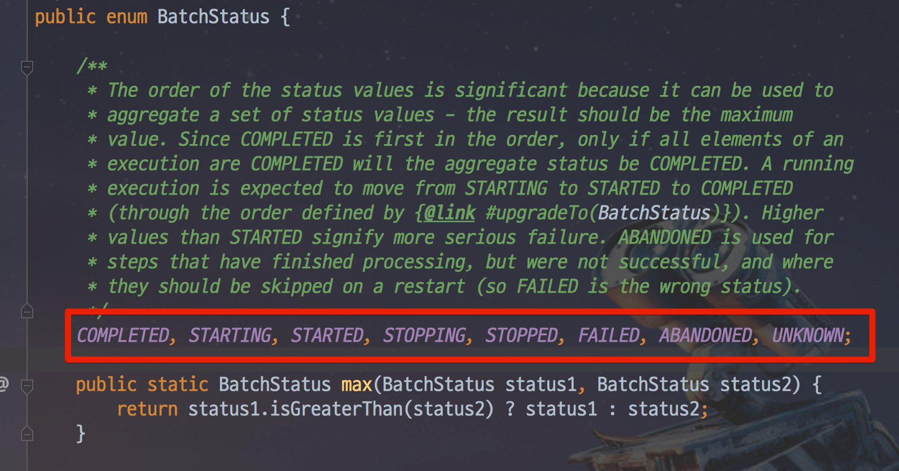

# springBootStudy

### Batch란?

- 배치(Batch)는 일괄처리 란 뜻을 갖고 있으며 일괄처리 모듈이라 보면 된다.
- 대량의 데이터 집계 및 통계 처리에 사용된다.
- Batch + 스케줄러로 합쳐서 사용된다.
- 정해진 시간마다 데이터 가공이 필요한 경우에 어디서든 Spring Batch가 사용될 수 있다.
<br/>
<hr/>

### Batch 사용 이유?
- 웹 서버에서 대량의 데이터를 집계 및 통계 와 같은 일괄 처리를 하게되면 웹의 Request, Response를 할 수 없게된다.
- 집계가 하루에 단 1번 수행 되는데 이것을 WebApplication으로 만드는 것 자체도 개발 시간 낭비이다.
- 집계 중간에 실패 시 (총 10만번 의 실행이 필요한 상태) 다시 처음부터 하기에는 비효율적임
- 이미 한번 실행된 Batch는 다시 실행되지 않기에 중복 집계를 방지 할 수 있음

### 사용 사례
- 일매출 집계 : 하루 거래건 50 ~ 100만 일경우 해당 거래 통계를 집계쿼리로 직접 조회하려면 조회 시간이나 서버의 부하가 심해지는데 이러한 경우 전날 새벽 배치를 통해 집계 데이터를 생성 한 후
해당 데이터를 확인 하는 용도로 사용
- ERP 연동 : 매일 매출 현관 이나 통계, 이력 자료를 배치를 통해 필요한 집계를 만들어 낸 후 해당 데이터를 DB에 적재 후 사용

#### ✅ 요약
웹 어플리케이션을 개발할때 비지니스 로직에 최대한 집중 할 수 있도록 Spring을 사용하는 것 처럼 Batch 개발시 비즈니스 로직에 집중 할 수있도록   
지원하는 모듈이 SpringBatch 이다. 

<br/>
<hr/>

### Batch Application 조건
- **대량 데이터** : 배치 어플리케이션은 대량의 데이;터를 가져오거나, 전달하거나 ,계산하는 등의 처리를 할 수 있어야한다.
- **자동화** : 배치 어플리케이션은 심각한 문제를 제외 하고는 사용자 개입 없이 실행되어야 한다.
- **견고성** : 배치 어플리케여슨은 잘못된 데이터를 충돌/중단 없이 처리할 수 있어야한다.
- **신뢰성** : 배치 어플리케이션은 무것이 잘못되었는지 추적할 수 있어야 한다.
- **성능** : 배치 어플리케이션은 지정한 시간 안에 처리를 완료하거나 동시에 실행되는 다른 어플리케이션을 방해하지 않도록 수행 되어야한다.

<br/>
<hr/>

### Batch 지원 Reader & Writer

- iBatis 모듈은 현재 삭제된 상태

|DataSource|기술|설명|
|---|---|---|
|Database|JDBC|페이징, 커서, 일괄 업데이트 등 사용 가능|
|Database|Hibernate|페이징, 커서 사용 가능|
|Database|JPA|페이징 사용 가능 (현재 버전에선 커서 없음)|
|File|Flat file|지정한 구분자로 파싱 지원|
|File|XML|XML 파싱 지원|


<br/>
<hr/>

### Batch 와 스케줄러(Quartz) 차이

- 스케줄러 : 설정 주기에 맞춰 반복해서 실행 하는 것
- 배치 : 대용량의 데이터를 처리하는 기능을 갖고 있음

#### ✅ 요약
배치 와 스케줄러는 비교 대상이 아니며 배치를 사용할 때는 해당 배치를 실행 시켜줄 때 스케줄러를 사용한다 보면 된다.  
대량의 데이터 처리를 위한 어플리케이션이 필요할 경우에는 Batch를 사용하고, 가벼운 주기적으로 실행될 가벼운 로직 같은 경우는  
Quartz를 사용해 스케줄링을 사용해 주자.


<br/>
<hr/>


### Spring Batch 사용 - Simple 예제 

- 1 ) Dependencies 추가
  - DB (사용할 DB를 지정 - H2 Database 사용시 자동으로 Batch 스키마 Table을 생성해 줌)
  - JPA ( Mybatis 중 선택 가능 )
  - Lombok
  - Batch
```groovy
// build.gradle

dependencies {
	implementation 'org.springframework.boot:spring-boot-starter-batch'
	implementation 'org.springframework.boot:spring-boot-starter-data-jpa'
	compileOnly 'org.projectlombok:lombok'
	runtimeOnly 'org.mariadb.jdbc:mariadb-java-client'
	annotationProcessor 'org.projectlombok:lombok'
	testImplementation 'org.springframework.boot:spring-boot-starter-test'
	testImplementation 'org.springframework.batch:spring-batch-test'
}
```

- 2 ) `projectName`Application에 Batch 사용 선언
```java
// "Project"Application

@SpringBootApplication
@EnableBatchProcessing  // ✅ batch를 사용하기 위해 "필수" 선언 [ Batch 기능 활성화 ]
public class BatchStudyApplication {
    public static void main(String[] args) {
        SpringApplication.run(BatchStudyApplication.class, args);
    }
}
```

- 3 ) JPA 설정 및 DB 연결 설정
  - 간단한 방법이기에 Code Skip

- 4 ) Job, Step 생성 
  - BeanFactory 등록을 위한 `@COnfiguration` 추가
  - Batch에 사용될 Job 과 Step을 생성 해줄 DI 주입
    - `@RequiredArgsConstructor` 어노테이션 추가 
    - `JobBuilderFactory` Job 생성 Class 추가
    - `StepBuilderFactory` Step 새성 Class 추가 
```java
// SimpleJobConfiguration 

@Log4j2
@RequiredArgsConstructor
@Configuration
public class SimpleJobConfiguration {

    private final JobBuilderFactory jobBuilderFactory;
    private final StepBuilderFactory stepBuilderFactory;

    // Job 생성
    @Bean
    public Job customSimpleJob() {
        return jobBuilderFactory.get("job1")    // ✅ 해당 이름으로 Job 생성            
                .start(customSimpleStep1())     // ✅ 시작 시 사용 될 Step 주입
                .build();
    }

    // Step 생성
    @Bean
    public Step customSimpleStep1(){
        return stepBuilderFactory.get("step2")              // ✅ 해당 이름으로 Step 생성
                .tasklet((contribution, chunkContext)->{    // 해당 Step 해서 수행될 기능 정의
                    log.info(">>>> THis is Step1");
                    return RepeatStatus.FINISHED;
                }).build();
    }

}
```

- 5 ) 실행 
  - ❌ Exception 발생 ( Message :: `spring_batch_BATCH_JOB_INSTANCE dosen't exist` )
    - 원인 : Spring Batch의 경우 중간에 문제가 겼을 경우 정지 된 부분 부터 재실행 및 중복 실행 방지를 위해 이력을 저장할 Meta Table이 필요하다
    - 해결 방법 : Meta Table 추가해준다.
      - 파일 찾기를 통해 `schema-사용DB.sql`을 찾은 후 해당 Create Query를 사용
      - 또는 해당 파일 위치를 서버 기동시 읽을 수 있게 sql-script를 사용해 주자
  - 👍 Meta Schema Table 생성 후 서버를 구동하면 정상적으로 배치가 실행된다.
    - 단 ! 한번 더 실행 시 중복 Job 실행으로  Error 발생
      - Error Message : `Duplicate entry '0' for key 'PRIMARY'`
  - ☠️☠️☠️☠️☠️☠️☠️☠️☠️☠️☠️☠️☠️☠️
  - 긴급 추가 [ 이걸로 삽질 2시간 함.. ]
  - ☠️☠️☠️☠️☠️☠️☠️☠️☠️☠️☠️☠️☠️☠️
    - SpringBoot 2.X 버전 사용시 위에서 제공해주는 쿼리 그대로 사용하면 시퀀스 값이 오르지 않는 문제 발생..
      - 해결 방법 - 해당 sql 파일에서 제공해주는 시퀀스에 생성해주는 insert 쿼리를 다른것을 사용하자
        - 사용 ❌
          - `INSERT INTO BATCH_STEP_EXECUTION_SEQ (ID, UNIQUE_KEY) select * from (select 0 as ID, '0' as UNIQUE_KEY) as tmp where not exists(select * from BATCH_STEP_EXECUTION_SEQ);`
          - `INSERT INTO BATCH_JOB_EXECUTION_SEQ (ID, UNIQUE_KEY) select * from (select 0 as ID, '0' as UNIQUE_KEY) as tmp where not exists(select * from BATCH_JOB_EXECUTION_SEQ);`
          - `INSERT INTO BATCH_JOB_SEQ (ID, UNIQUE_KEY) select * from (select 0 as ID, '0' as UNIQUE_KEY) as tmp where not exists(select * from BATCH_JOB_SEQ);`
        - 변경 👍
          - `INSERT INTO BATCH_STEP_EXECUTION_SEQ values(0, '0');`
          - `INSERT INTO BATCH_JOB_EXECUTION_SEQ values(0, '0');`
          - `INSERT INTO BATCH_JOB_SEQ values(0, '0');`
<br/>
<hr/>

### Job의 구조

- 하나의 Job은 여러개의 Step을 갖을 수 있다.
- Step에서의 사용 방식에는 2가지 방법 있다
  - Tasklet 방식
    - 사용자의 커스텀 방식대로 진행 되는 방식
  - Reader -> Processor -> Writer 방식
    - DB를 읽고 로직 사용 후 OutPut을 정의 하는 방식

<image src="https://t1.daumcdn.net/cfile/tistory/99E8E3425B66BA2713" />

<br/>
<hr/>

### Batch Meta Table

- **`ERD`** 구조


- 1 ) **BATCH_JOB_INSTANCE**
  - 실행 되었던 `Job Parameter`에 따라 생성되는 테이블이다.
    - 여기서 `Job Parameter`란 ?
      - Spring Batch가 실행도리 때 `외부`에서 받을 수 있는 파라미터 이다.
      - 특정 날짜를 Job Parameter로 넘기면 Spring Batch에서는 해당 날짜 데이터로 Batch 작업을 진행 할 수있다.
      - 같은 Job이라도 `Job Parameter가 "다르면" BATCH_JOB_INSTANCE`에 기록 된다.
  - 적용 Code
    - `@JobScope`를 사용해서 jobParameter를 변경 할 수 있게 함
    - `@Value("#{jobParameters[requestDate]}"`를 사용해 파라미터를 변경함
      - 여기서 `requestDate` 값은 Argument Parameter에서 받아옴
  - **결과 정리**
    - `BATCH_JOB_INSTANCE`테이블을 확인해 보면 `JOB_NAME`은 같아도 상관 없이 저장이 가능하지만 `Job Parameter`는 같으면 ***에러가 발생한다.*** 
```java
// SimpleJobConfiguration


public class SimpleJobConfiguration {

  private final JobBuilderFactory jobBuilderFactory;
  private final StepBuilderFactory stepBuilderFactory;

  @Bean
  public Job simpleJob() {
    return jobBuilderFactory.get("simpleJob")
            .start(simpleStep1(null))
            .build();
  }

  /**
   * jobParameters의 값이 이미 DB에 저장되어 있을 경우 실행 X
   * */
  @Bean
  @JobScope // ✅ 중요
  public Step simpleStep1(@Value("#{jobParameters[requestDate]}") String requestDate){
    return stepBuilderFactory.get("simpleStep1")
            .tasklet((contribution, chunkContext)->{
              log.info(">>>> THis is Step1");
              // 👉 받아온 jobParameters 출력
              log.info(">>>>>>>>>>>>> requestDate = {}",requestDate);
              return RepeatStatus.FINISHED;
            }).build();
  }

}
```


- 2 ) **BATCH_JOB_EXECUTION**
  - `BATCH_JOB_INSTANCE`와 부모-자식 관계이다.
  - `BATCH_JOB_INSTANCE`(부모)가 성공/실패했던 모든 내역을 갖고 있다.
    - 👉 중복된 Job Parameter로 인한 실패는 저장하지 않음
    - 실행 중 실패해야 저장된다.
  - 강제 Exception 발생 Code
    - Step을 한개 늘린 후 Step1에서 강제 Exception 발생
      - Error Message : `java.lang.IllegalArgumentException: Step 1에서 강제 에러 발생`
  - **결과 정리**
    - 실패 시 실패 상태로 저장된다. 
      - ✅ 실패한 `Job Parameter`로 2번 실행했는데 같은 파라미터로 실행되었다는 **에러가 발생하지 않았다**
    - Spring Batch는 동일한 `Job Parameter`로 **성공한 기록이 있을때만 재수행**이 안된다는 것을 알 수 있다.
      - 👉 예외를 발생 시키지 않는 코드로 작성시 `Status`가 `Completed`로 저장됨.

```java
// SimpleJobConfiguration

@Log4j2
@RequiredArgsConstructor
@Configuration
public class SimpleJobConfiguration {

  private final JobBuilderFactory jobBuilderFactory;
  private final StepBuilderFactory stepBuilderFactory;

  @Bean
  public Job simpleJob() {
    return jobBuilderFactory.get("simpleJob")
            .start(simpleStep1(null))
            .next(simpleStep2(null))    // 👉 Step1 끝난 후 다음 Step - 단 실행 되지 않음 ❌
            .build();
  }

  @Bean
  @JobScope
  public Step simpleStep1(@Value("#{jobParameters[requestDate]}") String requestDate){
    return stepBuilderFactory.get("simpleStep1")
            .tasklet((contribution, chunkContext)->{
              // ☠️ 강제 예외 발생  
              throw new IllegalArgumentException("Step 1에서 강제 에러 발생");
            }).build();
  }

  // ☠️ 해당 Step은 실행되지 않음
  @Bean
  @JobScope
  public Step simpleStep2(@Value("#{jobParameters[requestDate]}") String requestDate){
    return stepBuilderFactory.get("simpleStep2")
            .tasklet((contribution, chunkContext)->{
              log.info(">>>> THis is Step2");
              log.info(">>>>>>>>>>>>> requestDate = {}",requestDate); 
              return RepeatStatus.FINISHED;
            }).build();
  }
}
```

#### 💬 해당 예외로 인해 "FAILED"로 저장 `Status` 컬럼에 주목!


#### 💬 성공적으로 완료 시 "COMPLETED"로 저장 `Status` 컬럼에 주목!


- 3 ) **BATCH_JOB_EXECUTION_PARAM**
  - `BATCH_JOB_EXECTUTION`는 생성 될 당시 입력 받은 `Key값` 과 `Job Parameter`를 갖고 있다.


<br/>
<hr/>

### Next

- Job 에서 진행될 Step들을 연결할 때 사용된다.

👉 ↓ 아래 코드를 Job Parameter를 수정 후 실행 시 이전에 작성한  Batch도 같이 실행된다는 문제가 있다.
```java
// StepNextJobConfig

@Log4j2
@Configuration
@RequiredArgsConstructor
public class StepNextJobConfig {

  private final JobBuilderFactory jobBuilderFactory;
  private final StepBuilderFactory stepBuilderFactory;

  @Bean
  public Job stepNextJob(){
    return jobBuilderFactory.get("stepNextJob")
            .start(step1())
            .next(step2())
            .next(step3())
            .build();
  }
  
  // 아래와 같은 코드를 스텝별로 있음
  @Bean
  public Step step1(){
    return stepBuilderFactory.get("step1")
            .tasklet(((contribution, chunkContext) -> {
              log.info(">>>> THis is Step1");
              return RepeatStatus.FINISHED;
            })).build();
  }

}
```

👉 지정한 Batch Job만 실행하는 방법
- 문제
  - 현재 문제점은 Job parameter를 넣고 실행 시키면 다른 배치도 같이 진행 된다는 문제가 발생
- 해결방법
  - application.properties에 `spring.batch.job.names = ${job.name:NONE}` 설정을 추가하여 `job`이름까지 Argument parameter로 받아 실행
  - Argument Parameter 예시 `--job.name=stepNextJob version=???`
    - job.name은 내가 실행하고자 하는 `Job Name`과 맞춰줘야한다.

```properties
# application.properties

# Batch 이름 설정
## - Spring Batch가 실행 시, Program arguments로 job.name 값이 넘어오면 해당 값과 일치하는 Job만 실행
## - NONE이 할당되면 어떤 배치도 실행하지 않겠다는 의미입니다.
spring.batch.job.names = ${job.name:NONE}
```

<br/>
<hr/>

### Batch Step 흐름(Flow) 제어
- 만약 Step1 사용 도중 Step2가 아닌 Step3으로 가게 끔 제어가 하고싶을 수 있다.
- If 와 같은 개념으로 생각하자 내가 Step을 제어하는 것이다.

✅ 예시 코드
```java
// StepNextConditionalJobConfiguration

@Log4j2
@RequiredArgsConstructor
@Configuration
public class StepNextConditionalJobConfiguration {
  private final JobBuilderFactory jobBuilderFactory;
  private final StepBuilderFactory stepBuilderFactory;

  /**
   * 예상 시나리오
   * 1 ) Step1 실패 시나리오: step1 -> step3
   * 2 ) Step1 성공 시나리오: step1 -> step2 -> step3
   * */

  @Bean
  public Job stepNextConditionalJob(){
    return jobBuilderFactory.get("stepNextConditionalJob")
            .start(conditionalJobStep1())   // ✅ conditionalJobStep1()을 실행
            .on("FAILED")                // 👉 실패할 경우 - IF 문으로 보자
            .to(conditionalJobStep3())          // 👉 conditionalJobStep3()을 실행
            .on("*")                    // 👉 conditionalJobStep3()의 결과는 상관없이
            .end()                             // Job 종료
            .from(conditionalJobStep1())    // ✅ conditionalJobStep1()으로 부터 체이닝을 위해 재선언 (싫행은 X)
            .on("*")                    // 👉 FAILED 외에 모든 경우
            .to(conditionalJobStep2())          // 👉 step2로 이동한다.
            .next(conditionalJobStep3())        // 👉 step2가 정상 종료되면 step3으로 이동한다.
            .on("*")                    // 👉 step3의 결과 관계 없이
            .end()                             // 👉 step3으로 이동하면 Flow가 종료한다.
            .end()                          // ✅ Job 종료
            .build();
  }

  @Bean
  public Step conditionalJobStep1(){
    return stepBuilderFactory.get("step1")
            .tasklet((contribution, chunkContext) -> {
              log.info(">>>>> This is stepNextConditionalJob Step1");
              // 👉 일부러 상태를 "FAILED"로 만듬
              contribution.setExitStatus(ExitStatus.FAILED);
              return RepeatStatus.FINISHED;
            }).build();
  }

  @Bean
  public Step conditionalJobStep2() {
    return stepBuilderFactory.get("conditionalJobStep2")
            .tasklet((contribution, chunkContext) -> {
              log.info(">>>>> This is stepNextConditionalJob Step2");
              return RepeatStatus.FINISHED;
            })
            .build();
  }

  @Bean
  public Step conditionalJobStep3() {
    return stepBuilderFactory.get("conditionalJobStep3")
            .tasklet((contribution, chunkContext) -> {
              log.info(">>>>> This is stepNextConditionalJob Step3");
              return RepeatStatus.FINISHED;
            })
            .build();
  }

}
```

#### 💬 흐름(Flow) 제어 코드 의미
👉  아래의 메서드들은 모두 `체이닝 방식`을 사용한다.
- `.on()`
  - 앞에서 실행되 었던 Job 또는 tep의 `상태(ExitStatus)`로 종료 되었는지 확인 한다 **( if문에서 `a == 0`과 같은 조건을 확인 한다 보면 된다. )**
  - `*`을 사용할 경우 모든 `상태(ExitStatus)`를 `True`로 생각한다.
- `to()`
  - `on()` 이후에 진행 될 Step을 지정한다.
- `from()`
  - 이밴트가 발생할 대상을 지정 **(이벤트 리스너라 생각하자)**
  - 재정의라 보면 된다.
  - 상태값을 보고 일치하는 상태라면 `to()`에 해당하는 Step을 실행
  - 위의 예제코드상에서는 else의 기능을 이어주는 리스너 기능으로 보자
  - Step1의 이벤트 캐치가 `FAILED`로 되어있는 상태에서 `추가로 이벤트 캐치`를 하려면 꼭 사용해줘야한다.
- `end()`
  - `FlowBuilder`를 종료하는 방법이며 **2가지 방법**이 존재함.
    - `on("*")`뒤에 있는 `end()`는 FlowBuilder를  **반환**하는 `end()`
      - 반환하는 `end()` 사용시 `from()`을 사용해서 계속해서 **조건을 이어갈 수 있다.**
    - `build()`앞에 있는 가장 마지막 `end()`의 경우 FlowBuilder를 **종료**하는 `end()`

#### 💬 중요포인트
- `on()`에서 캐치되는 상태값은 `BatchStatus`가 아닌 `ExitStatus`이다!
  - Step에서 마지막에 사용되는 return 값 `return RepeatStatus.FINISHED;` 해당 값이 `ExitStatus`이다
#### 💬 `Batch Status` 와 `ExitStatus` 차이
  - `BatchStatus`란?
    - Job 또는 Step의 실행 결과를 Spring에 기록할 때 사용하는 Enum 값이다.
    - 
  - `ExitStatus`란?
    - Step의 실행 후 상태를 말한다. 여기서 중요한 점은 해당 값은 Enum이 아닌 `ExitStatus`객체 이다.
    - `on()`에서 catch 하는 값은 해당 `ExitStatus`값이다.

<br/>
<hr/>

### JobExecutionDecider란?

- Step의 종료 값인 `ExitStatus`뿐 만으로는 분기처리 하는데 무리가 있는데 `JobExecutionDecider`를 사용해서 `Custom ExitStatus`를 생성하여 해결할 수 있다. 
- 사용 방법
  - 1 ) `JobExecutionDecider`를 구현한 class 생성
    - `FlowExecutionStatus decide()` 내부에 사용할 로직 및 결과에 맞는 `ExitStatus`값 생성
  - 2 ) 위에서 작성한 class를 Batch에서 사용하기 위해 `@Bean`을 위한 생성 Method 생성
  - 3 ) `Job` 내부 코드에서 Flow방식으로 사용

✅ 예시 코드
```java
// DeciderJobConfiguration

@Log4j2
@Configuration
@RequiredArgsConstructor
public class DeciderJobConfiguration {

  private final JobBuilderFactory jobBuilderFactory;
  private final StepBuilderFactory stepBuilderFactory;

  @Bean
  public Job deciderJbo(){
    return jobBuilderFactory.get("deciderJob")  // Job Name
          .start(startStep())                   // Start Step
            .next(decider())                        // 👉 Decider 주입
            .on("ODD")                              // 👉 Decider에서 커스텀한 값
            .to(oddStep())                          // 일치할 경우 "oddStep()" 실행
          .from(decider())                      // 👉 EventListener 재등록
            .on("EVEN")                             // 👉 Decider에서 커스텀한 값
            .to(evenStep())                         // 일치할 경우 "evenStep()" 실행
          .end()                                // 종료
          .build();
  }

  @Bean
  public Step startStep(){
    return stepBuilderFactory.get("startStep")
            .tasklet((contribution, chunkContext) -> {
              log.info(">>>> Start!");
              return RepeatStatus.FINISHED;
            })
            .build();
  }

  // 짝수
  @Bean
  public Step evenStep(){
    return stepBuilderFactory.get("evenStep")
            .tasklet((contribution, chunkContext) -> {
              log.info("짝수 입니다!!");
              return RepeatStatus.FINISHED;
            }).build();
  }

  // 홀수
  @Bean
  public Step oddStep(){
    return stepBuilderFactory.get("oddStep")
            .tasklet((contribution, chunkContext) -> {
              log.info("홀수 입니다!!");
              return RepeatStatus.FINISHED;
            }).build();
  }

  // ✅ Bean Factory 등록 👉 중요
  @Bean
  public JobExecutionDecider decider(){
    return new OddDecider();
  }

  /**
   * 👉 JobExecutionDecider를 구현한 Inner class
   * **/
  public static class OddDecider implements JobExecutionDecider{
    @Override
    public FlowExecutionStatus decide(JobExecution jobExecution, StepExecution stepExecution) {
      int randomNum = new Random().nextInt(50);
      log.info("randomNum ::: {}",randomNum);
      String result = randomNum % 2 == 0 ? "EVEN" : "ODD";
      return new FlowExecutionStatus(result);
    }
  }

}
```

<br/>
<hr/>

### JobParameter 와 Scope
- `JobParameter`란?
  - 외부 혹은 내부에서 `파라미터`를 받아 여러가지의 Batch를 사용할 수 있게 하는 것
  - `JobParameter`를 사용하기 위해선 **꼭 `Scope 어노테이션`을** 선언해야한다.
    - 사용 가능한 Scope 어노테이션는 크게 `@StepScope` 와 `@JobScope` 2가지가 있다.
    - 사용 방법은 SpEL(Spring Expression Language)로 선언해서 사용 가능하다.
      - >`@Value("#{jobParameters[파라미터명]}")`
  - `@StepScope` & `@JobScope` 요약 소개
    - `@StepScope` : (Tasklet, ItemReader, ItemWriter, ItemProcessor 등)에 사용하게 되면 Step의 실행 시점에 해당 컴포넌트를 Spring Bean으로 생성  
    👉 단계(Step)의 범위를 정의할때 사용한다.  - **배치 작업의 각 단계에 대한 범위를 정의**
    - `@JobScope`는 Job 실행 시점에 Bean 생성  👉 ( Job의 범위를 정의할 때 사용된다. - **배치 작업 전체에 대한 범위를 정의합니다**)
    - JobParameter 자체는 `Spring MVC`와 굉장히 유사하다.
      - `MVC`에서 처럼 요정(Request),응답(Response) 후 사라지는것 과같이 Job이 실행 되고 끝나거나 Step이 실행되고 끝날때 사라지는 것이 같다

✅ `@JobScope` 사용 예시 코드
```java
// JobParameterJobConfiguration 

@Configuration
@Log4j2
@RequiredArgsConstructor
public class JobParameterJobConfiguration {

  private final JobBuilderFactory jobBuilderFactory;
  private final StepBuilderFactory stepBuilderFactory;


  /**
   * 👉 같은 이름의 Bean이 겹치면
   * - Error : could not be registered. A bean with that name has already been defined in class path resource 발생
   * */


  @Bean
  public Job scopeJob(){
    return jobBuilderFactory.get("scopeJob")
            /**
             * null을 입력해도 Step 단계에서  로그가 찍히는 이유눈
             * Job Parameter의 할당이 어플리케이션 실행시에 하지 않기 때문에 가능합니다.
             * */
            .start(scopeStep1( null))
            .build();
  }

  /**
   * 👉 @JobScope가 없을 시 Error 발생
   * - Error :  EL1008E: Property or field 'jobParameters' cannot be found on object of type 에러 발생
   * */
  @JobScope
  @Bean
  public Step scopeStep1(@Value("#{jobParameters[requestDate]}")String requestDate){
    return stepBuilderFactory.get("step1")
            .tasklet((contribution, chunkContext) -> {
              log.info("param ::: {}", requestDate);
              return RepeatStatus.FINISHED;
            }).build();
  }
}
``` 
✅ `@StepScope` 사용 예시 코드 (다양한 방법으로 사용 가능)
```java
// JobParameterStepScopeConfiguration  

@Configuration
@Log4j2
@RequiredArgsConstructor
public class JobParameterStepScopeConfiguration {
    
  @Bean
  @StepScope
  public ListItemReader<Integer> simpleWriterReader(){
    List<Integer> item = IntStream.rangeClosed(1,50).boxed().collect(Collectors.toList());
    return new ListItemReader<>(item);
  }
}

////////////////////////////////////////////////////////////////////////////////////////////////////////////
////////////////////////////////////////////////////////////////////////////////////////////////////////////
////////////////////////////////////////////////////////////////////////////////////////////////////////////

// SimpleTasklet

@Log4j2
@Component
@StepScope
public class SimpleTasklet implements Tasklet {

  @Value("#{jobParameters[requestDate]}")
  private String requestDate;

  @Override
  public RepeatStatus execute(StepContribution contribution, ChunkContext chunkContext) throws Exception {
    log.info("This is Step1 Tasklet Class Call Method");
    log.info("requestDate ::: {}", requestDate);
    return RepeatStatus.FINISHED;
  }
}
``` 

<br/>
<hr/>

### `@StepScope` , `@JobScope` 장점
- 첫번째 : `Late Binding`이 가능하다.
  - Application의 실행 시점에 주입되는것이 아닌 원하는 로직중간에서 (Controller 혹은 Service)에서 `JobParameter` 할당이 가능하다.
- 두번째 : 동일 컴포넌트를 병렬 혹은 동시 사용 가능하다. 
  - Step 내부에 Tasklet이 있고 해당 Tasklet 내부에서는 멤버 변수가 있고 이 멤버변수가 있는 로직이 존재한다면 이러한 경우 `@StepScope` 없이 병렬로 실행 시키면  
  서로 다른 Step에서 하나의 Tasklet을 두고 마구잡이로 상태를 변경 하려는 문제가 있는데 이러한 문제를 방지 할 수 있다. ****( 각각의 Step에서 별도의 Tasklet을 생성하고  
  관리 하기떄문에 서로의 상태를 침범 하지 않음 )****

   
<br/>
<hr/>

### `JobParameter` 사용 시 주의사항
- Step, Tasklet, Reader 등의 Batch 컴포넌트 Bean의 생성 시점에 호출이 가능 하지만
  - 여기서 주의할 점은 `Sopce Bean`을 생성 할때만 가능하다는 것이다.
  - `Sopce Bean`은 간단하게 말하면 ( `@StepScope` , `@JobScope`) 해당 어노테이션을 붙여서 생성되는 Bean 객체를 말한다.

✅ `Sopce Bean` 사용하지 않을 경우 에러 코드
```java
// SimpleTasklet

@Log4j2
@Component
/**
 * 미사용시 Error 발생
 * Error Msg : bean with name 'simpleTasklet': Unsatisfied dependency expressed through field 'requestDate';
 * */
@StepScope
public class SimpleTasklet implements Tasklet {

  @Value("#{jobParameters[requestDate]}")
  private String requestDate;

  @Override
  public RepeatStatus execute(StepContribution contribution, ChunkContext chunkContext) throws Exception {
    log.info("This is Step1 Tasklet Class Call Method");
    log.info("requestDate ::: {}", requestDate);
    return RepeatStatus.FINISHED;
  }
}

////////////////////////////////////////////////////////////////////////////////////////////////////////////
////////////////////////////////////////////////////////////////////////////////////////////////////////////
////////////////////////////////////////////////////////////////////////////////////////////////////////////

// JobParamErrorJobConfiguration

@Log4j2
@Configuration
@RequiredArgsConstructor
public class JobParamErrorJobConfiguration {
  private final StepBuilderFactory stepBuilderFactory;
  private final JobBuilderFactory jobBuilderFactory;

  //  👉 DI 주입
  private final SimpleTasklet simpleTasklet;

  @Bean
  public Job simpleTaskletJob(){
    return jobBuilderFactory.get("simpleTaskletJob")
            .start(scopeTaskletCallStep1())
            .build();
  }

  @Bean
  public Step scopeTaskletCallStep1(){
    return stepBuilderFactory.get("scopeTaskletCallStep1")
            .tasklet(simpleTasklet).build(); // 👉생성한 Tasklet 사용
  }
}
```

<br/>
<hr/>

### 만약 외부 Cotroller에서 사용 하려면 ?
- 일단 웹서버에서 Batch를 돌리는것은 권장 되지 않는다 대량의 데이터 처리를 하려면 그만큼의 서버에 부하가 오기 떄문임.

✅ 예시 코드
```java
// java - JobLauncherController

@RequiredArgsConstructor
@RestController
public class JobLauncherController {

  private final JobLauncher jobLauncher;
  private final Job job;

  @GetMapping("/launchjob")
  public String handle(@RequestParam("fileName") String fileName) throws Exception {
    try {
      JobParameters jobParameters = new JobParametersBuilder()
              // 파라미터 설정
              .addString("input.file.name", fileName)
              // 시간 설정
              .addLong("time", System.currentTimeMillis())
              // jobParameter 생성
              .toJobParameters();
      // Job 실행
      jobLauncher.run(job, jobParameters);
    } catch (Exception e) {
      log.info(e.getMessage());
    }

    return "Done";
  }
}
```


<br/>
<hr/>

### Chunk

- 데이터 덩어리로 작업할 떄 각 `커밋 사이에 처리되는 row 수`를 말한다.
- 한번에 하나씩 데이터를 읽어 Chunk 덩어리를 만든 뒤, `Chunk 단위로 트랜잭션을 다룬다.`
  - 실패할 경우 엔 해당 `Chunk 만큼만 롤백` 되고, 이전에 커밋된 트랜잭션 범위까지는 반영이 된다.
- `Page Size` 와 `Chunk Size`는 다른 개념이다.
  - `Page Size` : 한번에 조회할 Item의 양 이다.
  - `Chunk Size` : 한번에 처리될 트랜잭션 단위이다.
  - 👉 2개 값을 일치시키는 것이 보편적으로 좋은 방법이니 꼭 2개 값을 일치시키시길 추천드립니다.
- Step은 Tasklet 단위로 처리되고, Tasklet 중에서  `ChunkOrientedTasklet`을 통해 Chunk를 처리하며 이를 구성하는 3요소로는 `ItemReader`, `ItemWriter`, `ItemProcessor`가 있다.

> 💬 요약 : ItemReader & ItemWriter & ItemProcessor의 묶음 역시 Tasklet 이다.  
> 이들의 묶음을 ChunkOrientedTasklet에서 관리하기 때문이다..

#### 💬 [상세 설명 참고](https://jojoldu.tistory.com/331?category=902551)
✅ Chunk Java 예시 코드
```java
class Foo{
    
    public void testCode(){
        int totalSize = 10;
        for(int i = 0; i < totalSize ; i += chunkSize){ // 👉 chunkSize 단위만큼 추가
            List items = new Arraylist();
            // 👉 chunkSize 내부 사이즈 만큼 For 문
            for(int j = 0; j < chunkSize; j++){
              Object item = itemReader.read();
              Object processedItem = itemProcessor.process(item);
              items.add(processedItem);
            }// for
            itemWriter.write(items);
        }//for   
      
    }// method
  
}
```