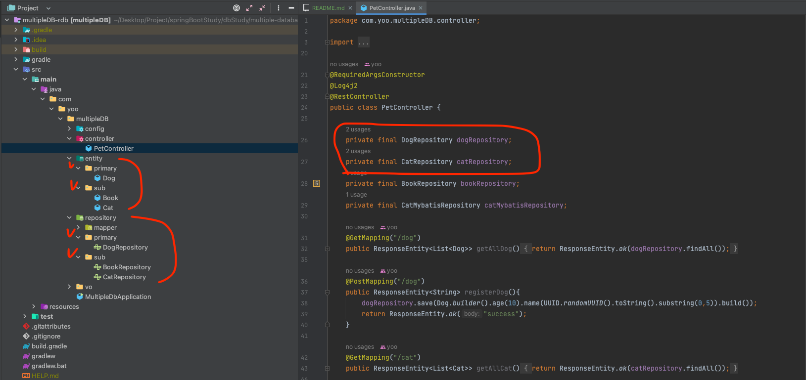
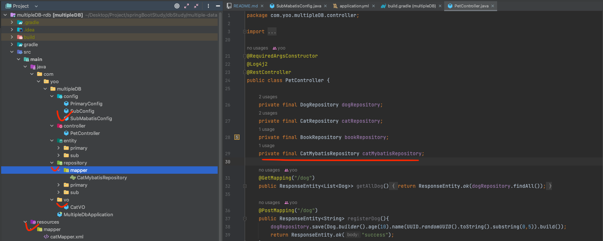

# 다중 DB 설정 

```properties
# ℹ️ Mariadb를 사용해여 테스트 진행
#    - 메인은 JPA를 기준으로 함
#    - Port : 3306, 3333
#
# 💬 3306 : 모든 권한, 3333 : 읽기 권한으로 진행         
```

## JPA 와 JPA

### build.gradle
```groovy
dependencies {
	implementation 'org.springframework.boot:spring-boot-starter-data-jpa'
	runtimeOnly 'org.mariadb.jdbc:mariadb-java-client'
s}
```

### application.yml

- DB Connection 설정 값 경우 `url` -> `jdbc-url`로 **변경 필요**
- jpa ddl 설정
  - 메인
    - 기존과 같은 spring -> **datasource** 하위 작성
  - 서브
    - spring -> **<사용자 지정 값>** 하위 작성
- ✅ ddl-auto 설정
  - 일반적인 JPA의 ddl 설정과 같게 설정해도 해당 설정을 읽지 않기에 `ConfigClass`에서 **추가 설정**이 **필요**하다	

```yaml
spring:
  datasource:
    #url: jdbc:mariadb://localhost:3306/test
    jdbc-url: jdbc:mariadb://localhost:3306/test
    username: root
    password: 123
    driver-class-name: org.mariadb.jdbc.Driver
  # 사실상 적용되지 않음 - Config Class에서 해당 값을 읽어 처리 필요
  jpa:
    hibernate:
      ddl-auto: update

  sub-db:
    jdbc-url: jdbc:mariadb://localhost:3333/foo
    username: yoo
    password: 123
    driver-class-name: org.mariadb.jdbc.Driver
    jpa:
      hibernate:
        # 검증만 진행
        ddl-auto: validate
```

### Config Class

#### 메인 DB
- `@Primary`를 사용해서 메인 DB 지정이 필요
  - 동일 타입의 여러 `Bean` 중에서 **기본적으로 사용**될 **Bean을 지정**하기 위함
- `@EnableJpaRepositories`를 사용해서 JPA Repository 설정 필요
  - basePackages : 해당 설정 값으로 Scan 할 **Repository 패키지 위치**
  - entityManagerFactoryRef : **Entity 설정** 값을 읽을 **Bean 이름**
  - transactionManagerRef : **트랜잭션 설정** 값을 읽을 **Bean 이름**
- `@ConfigurationProperties(prefix = "spring.datasource")` 
  - 설정을 통해 DB Connection 설정 값을 properties에서 읽음
- `Environment`를 통해 환경 변수를 읽어옴
  - JPA ddl 설정을 위해 필요
  -  `environment.getProperty("해당 yml 내 값 위치", "없을 경우 기본 값");`

```java
@Configuration
// JPA Repository Bean 활성화
@EnableJpaRepositories(
        // JPA Repository가 위치한 패키지 지정
        basePackages = "com.yoo.multipleDB.repository.primary",
        // 해당 데이터 소스에 대한 엔티티 매니저 팩토리 지정
        entityManagerFactoryRef = "primaryEntityManager",
        // 트랜잭션 매니저를 지정하여 JPA의 트랜잭션을 관리
        transactionManagerRef = "primaryTransactionManager"
)
public class PrimaryConfig {

    /**
     * @Primary를 사용하여 동일 타입의 여러 Bean 중에서 기본적으로 사용될 Bean을 지정하는 것
     * */

    @Bean
    @Primary
    // application properties 값을 읽어옴
    @ConfigurationProperties(prefix = "spring.datasource")
    public DataSource primaryDataSource() {
        // DataSourceBuilder를 사용하여 DataSource를 생성
        return DataSourceBuilder.create().build();
    }

    @Primary
    @Bean(name = "primaryEntityManager")
    public LocalContainerEntityManagerFactoryBean primaryEntityManager(
            EntityManagerFactoryBuilder builder,
            @Qualifier("primaryDataSource") DataSource dataSource,
            // 환경 변수를 읽기 위함
            Environment environment  ) {

        // Hibernate DDL 옵션 설정
        Map<String, String> jpaProperties = new HashMap<>();
        // 설정 파일에서 DDL 옵션 값 읽기
        String ddlAuto = environment.getProperty("spring.jpa.hibernate.ddl-auto", "validate"); // 기본값 "validate"
        System.out.println("--------------------");
        System.out.println(ddlAuto);
        System.out.println("--------------------");
        jpaProperties.put("hibernate.hbm2ddl.auto", ddlAuto);

        return builder
                .dataSource(dataSource)
                // Entity 클래스가 위치한 패키지를 지정
                .packages("com.yoo.multipleDB.entity.primary")
                // 해당 데이터 소스의 persistence unit 이름 지정
                .persistenceUnit("primarydb")
                .properties(jpaProperties) 
                .build();
    }

    @Primary
    @Bean(name = "primaryTransactionManager")
    public PlatformTransactionManager primaryTransactionManager(
            @Qualifier("primaryEntityManager") EntityManagerFactory entityManagerFactory) {
        //  JPA 트랜잭션을 관리하는 Spring의 트랜잭션 매니저, EntityManagerFactory를 사용하여 트랜잭션을 관리
        return new JpaTransactionManager(entityManagerFactory);
    }
}
```

### SubConfig Class
- 메인 DB 설정 과 **다른점**
  - `@Primary`을 사용하지 않음
  - DB Connection 설정 properties 
  - Repository 패키지 위치
  - Entity 패키지 위치

```java
@Configuration
@EnableJpaRepositories(
        basePackages = "com.yoo.multipleDB.repository.sub",
        entityManagerFactoryRef = "subEntityManager",
        transactionManagerRef = "subTransactionManager"
)
public class SubConfig {
    @Bean
    @ConfigurationProperties(prefix = "spring.sub-db") // 두 번째 데이터 소스에 대한 설정
    public DataSource subDataSource() {
        return DataSourceBuilder.create().build();
    }

    @Bean(name = "subEntityManager")
    public LocalContainerEntityManagerFactoryBean subEntityManager(
            EntityManagerFactoryBuilder builder,
            @Qualifier("subDataSource") DataSource dataSource) {
        return builder
                .dataSource(dataSource)
                .packages("com.yoo.multipleDB.entity.sub") // Sub 데이터베이스 엔티티 경로
                .persistenceUnit("subdb")
                .build();
    }

    @Bean(name = "subTransactionManager")
    public PlatformTransactionManager subTransactionManager(
            @Qualifier("subEntityManager") EntityManagerFactory entityManagerFactory) {
        return new JpaTransactionManager(entityManagerFactory);
    }
}
```

#### Entity 와 DB의 컬림이 다를 경우
- 서브로 사용하는 Table 컬럼과 Entity의 필드가 다를 경우가 존재한다. - ( **읽기 권한이라 ddl 조작 불가능** )
  - 문제점
    - Entity의 컬럼을 DB에 맞춰도 **조회 시 에러** 발생
      - DB 컬럼
        - bookCnt
      - Entity
        - book_cnt
  - 해결 방법
    - 1 ) 테이블 자체의 컬럼을 수정한다.
      - 해당 방법이 가장 깔끔하고 알맞은 방식 DB의 컬럼명은 카멜케이스를 잘 사용하지 않는다.
    - 2 ) JPA 설정 수정
      - 해당 설정을 사용할 경우 모든 JPA가 전역적으로 적용 되기에 사이드 이펙트가 더 커질 수 있음
      ```yaml
      jpa:
        properties:
          # ✅ 아래 설정을 할 경우 Code 내 정의된 Entity 정보대로 Query 함
          hibernate:
            naming:
              physical-strategy : org.hibernate.boot.model.naming.PhysicalNamingStrategyStandardImpl
      ```

#### 구조
- 메인과 서브에서 설정한 패키지위치에 맞게 끔 사용하면 문제가 없이 구동 된다.


### Querydls
```properties
# ℹ️ Querydsl 사용 설정은 Skip
```
- JPA의 @PersistContext 어노테이션을 사용할 경우 EntityManager 에 프록시 인스턴스를 주입시켜준다.
- Primary DB는 기본 EntityManager를 사용하기 때문에 setEntityManager를 명시적으로 선언하지 않아도 된다.
-  다른 데이터베이스를 사용할 때는 명시적으로 `@PersistenceContext(unitName="subEntityManager")`를 선언해야 하고, 이때 setEntityManager를 통해 EntityManager를 **수동으로 설정하는 방식이 필요**


#### 설정 방법
- `QuerydslRepositorySupport` Class의 setEntityManager() 메서드를 @Override 후 **PersistenceContext** 지정
- `@PersistenceContext(unitName="subEntityManager")`에서 지정하는 unitName명은 SubDB 설정때 명시했던 EntityManager 명이다. 	
```java
public class EventInfoSupportImpl extends QuerydslRepositorySupport implements EventInfoSupport {
    public EventInfoSupportImpl() { super(EventInfoView.class); }

    @Override
    @PersistenceContext(unitName="subEntityManager")
    public void setEntityManager(EntityManager entityManager) {
        super.setEntityManager(entityManager);
    }
}
```


## JPA 와 Mybatis
```properties
# ℹ️ 메인 DB의 경우 위와 같은 설정이기에 스킵
```

### build.gradle

```groovy
dependencies {
	// Mybatis
	implementation 'org.mybatis.spring.boot:mybatis-spring-boot-starter:3.0.4'
	testImplementation 'org.mybatis.spring.boot:mybatis-spring-boot-starter-test:3.0.4'

}
```

### application.yml

- 중요 포인트
  - **Mapper xml 경로 설정**을 yml에서 **진행하지 않는다**는 것이다.

```yaml
spring:
  datasource:
    jdbc-url: jdbc:mariadb://localhost:3306/test
    username: root
    password: 123
    driver-class-name: org.mariadb.jdbc.Driver
    jpa:
      hibernate:
        ddl-auto: update

  # 서브 DB2 (MyBatis 사용)
  sub-db2:
    jdbc-url: jdbc:mariadb://localhost:3333/foo
    username: yoo
    password: 123
    driver-class-name: org.mariadb.jdbc.Driver
```

### DB Config Class

- `@MapperScan` 설정
  - 사용할 Repository Interface **패키지 위치 지정**
- `PathMatchingResourcePatternResolver` 인스턴스에 **MyBatis XML 파일 경로 설정** 

```java
@Configuration
@MapperScan(basePackages = "com.yoo.multipleDB.repository.mapper", sqlSessionFactoryRef = "subMybatisSqlSessionFactory")
public class SubMabatisConfig {

    @Bean(name = "subMybatisDataSource")
    @ConfigurationProperties(prefix = "spring.sub-db2")  // 'sub-db2' 데이터소스를 사용
    public DataSource subMybatisDataSource() {
        return DataSourceBuilder.create().build();
    }

    @Bean(name = "subMybatisSqlSessionFactory")
    public SqlSessionFactory subMybatisSqlSessionFactory(@Qualifier("subMybatisDataSource") DataSource dataSource)
            throws Exception {
        SqlSessionFactoryBean factoryBean = new SqlSessionFactoryBean();
        factoryBean.setDataSource(dataSource);

        // MyBatis XML 파일 경로 설정
        factoryBean.setMapperLocations(
                new PathMatchingResourcePatternResolver().getResources("classpath:mapper/**/*.xml")
        );

        return factoryBean.getObject();
    }

    @Bean(name = "subMybatisTransactionManager")
    public DataSourceTransactionManager subMybatisTransactionManager(@Qualifier("subMybatisDataSource") DataSource dataSource) {
        return new DataSourceTransactionManager(dataSource);
    }
}
```

### 구조

