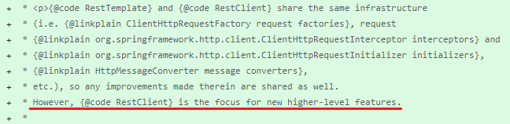

# REST API, Swagger, RestTemplate, WebClient

## 1 ) REST API 란❔

- 👉 각각의 Method 의미
  - POST : Create
  - GET  : Read
  - PUT  : Update  ( 일부분 변경 요청하면 **다른 값이 다 null** )
  - PATCH  : Update ( 변경 **요청한 부분만 변경**된다  )  
  - DELETE : Delete
  - HEAD : header 정보 조회
- 👉 장/단점
  - 장점👍
    - 1 . HTTP 표준 프로토콜에 따르는 모든 플랫폼에서 사용이 가능하다.
    - 2 . REST API 메세지가 의도하는 바를 명확하게 나타내므로 의도하는 바를 쉽게 파악 가능하다.
    - 3 . 서버와 클라이언트의 역활을 명확하게 분리가 가능하다.
  - 단점👎
    - 1 . 표준이 존재하지 않는다.
    - 2 . 사용 가능한 메서드가 한정적이다.
    - 3 . 불필요한 정보까지 가져올 수 있다. [GraphQL 과 비교됨]
- 👉 REST 구성요소
  - 1 . 자원(Resource) : URI
    - 모든 자원에 고유한 ID가 존재하고, 이 자원은 Server에 존재한다.
    - 모든 자원을 구별하는 ID는 "/user/{userNo}"와 같은 HTTP URI 형식이다.
    - Client에서는 URI를 이용해서 자연월 지정하고 해당 자원의 상태에 대한 조작을 Server에 요청한다.
  - 2 . 행위(Verb) : HTTP Method
    - HTTP 프로토콜의 Method를 사용한다.
    - HTTP 프로토콜은 GET, POST, PUT, PATCH, DELETE 와 같은 메서드를 제공한다. 
  - 3 . 표현(Representation of Resource)
    - Client가 자원의 상태에 대한 조작을 요청하면 Sever는 이에 적당한 응답(Response)울 보낸다.
    - JSON, XML, TEXT, RSS 등 어려 형태의 응답으로 보내줄 수 있다. [ 일반적으로 JSON, XML로 응답함. ]
- 👉 REST 특징
  - 1 . Server-Client 구조이다.
    - 자원이 있는 쪽은 Server , 자원을 요청하는 쪽은 Client 이다
    - 위와 같은 구조로 서로간의 의존성을 줄인다.
  - 2 . Stateless(무상태) -- [ 💬 반대 개념 ? : Stateful(세션이 종료될 때까지의 통신 개념) ]
    - HTTP Protocol은 Stateless Protocol이므로 REST 역시 무상태성을 갖는다.
    - Client의 context를 Server에 저장하지 않는다.
      - 세션과 쿠키와 같은 context 정보를 신경쓰지 않아도 되므로 구현이 간단함.
    - Server는 각각의 요청을 완전히 별개의 것으로 인식 처리
      - 간단하게 들어온 Method에 맞게만 처리해주면 된다.
      - 이전 요청이 다음 요청과 로직 및 처리가 연관 되어서는 안된다.
      - Server의 처리 방식에 일관성을 부여하고 부담을 줄여주며 서비스의 자유도가 향상된다.
  - 3 .  Cacheable(캐시 처리 기능)
    - 웹 표준 HTTP 포로토콜을 그대로 사용하므로 웹에서 사용하는 기존 인프라를 그대로 사용 가능함.
  - 4 . Layered System(계층화)
    - Client는 RESTAPI를 호출만 가능하다.
    - REST Server는 다중 계층으로 구성될 수 있다.
    - 로드 밸런싱, 공유 캐시 등을  통해 확장성과 보안성을 향상 시킬 수 있다.
  - 5 . Uniform Interface(인터페이스 일관성)
    - URI로 지정한 Resource에 대한 조작을 통일되고 한정적인 인터페이스로 수행한다.
    - HTTP 표준 프로토콜에 따르는 모든 플랫폼에서 사용이 가능하다 [ 특정 언어나 기술에 종속 되지 ❌ ]
- 👉 REST API 설계 기본 규칙
  - 1 . URI는 정보의 자원을 표시 해야한다.
    - resource는 동사 👎 - > **명사** 👍
    - resource는 대문자 👎 - > **소문자** 👍
  - 2 . 자원에 대한 행위는 HTTP Method로  표현한다.
    - URI에 의도가 보이지 않고 HTTP Method를 사용해서 의도를 구분해야 함
      - Ex) GET /members/show/1 👎 -> GET /members/1
      - Ex) GET /members/insert/2 👎 -> POST /members/1
  - 3 . 슬래시 구분자(/)는 계층 관계를 나타내는데 사용한다.
    - Ex) https://blackgom.com/cities/townships
  - 4 . URI 마지막 문자로 / 를 포함하지 않는다.
  - 5 . URI 경로에는 언더바( "_" ) 는  **사용하지 ❌** // 불가피하게 URI가 긴 경우 **하이픈( "-" )을 사용** 👍
  - 6 . URI 경로에는 **소문자가 적합**하다.
    - RFC 3986(URI 문법 형식)은 URI 스키마와 호스트를 제외하고는 대소문자를 구별하도록 규정하기 때문
  - 7 . URI 경로에는 **파일 확장자를 포함하면 안된다.**  - [ 💬 필요한다면 Accept Header에 추가 ]
    - Ex) `/cities/townships/photo/336/yoo.jpg`  👎
    - Ex) `/cities/townships/photo/336`   -> `header :  Accept:image/jpg`  👍


## 2 ) @RestController 란❔

- 반환 메서드 마다 `@ResponseBody`를 사용하지 않아도 된다.
  - `@RestController`에노테이션이 기본적으로 JSON 반환을 의미하기 때문
- @RestController 와 @Controller 차이점 [ 간단설명 ]  
  - @Controller : Model 또는 @ResponseBody를 사용하여 데이터를 전달할 수 있지만 주된 기능은 View를 반환하기 위해 사용
  - @RestController : @Controller에 + @ResponseBody로 생각하면 된다, 주된 용도는 Json 형태로 객체 데이터를 반환하는 것이다.


## 3 ) Consumes 와  Produces ❔

### Consumes 
```properties
# ℹ️ Get 방식일 경우에는 Consumes가 불필요 -> URI형태로 받기에 Body를 사용할 수 없기 때문
```
- 소비 가능한 미디어 타입을 지정하는 것이며 주요한 매핑을 제한 할수있다.
  - HTTP 통신 대상의 Content-Type 요청 헤더가 **Consumes에 지정한 미디어 타입**과 **일치할 때만 요청 성공**


#### Controller 🔽
```java
@RestController
class TestController{
  @PostMapping(value = "/consumesSuccess", consumes = MediaType.APPLICATION_JSON_VALUE)
  public ResponseEntity<Map<String, String>> errorCase2(@RequestBody Map<String, String> testValue){
  
          log.info("testValue :: {}", testValue);
  
          Map<String , String > result = new HashMap<>();
          result.put("result","SUCCESS");
  
          return ResponseEntity.ok().body(result);
  }
}
```
#### Client 🔽
```javascript
function consumesSuccess(){
    fetch("/replies/consumesSuccess"
        ,{
            method: "POST" ,
            headers: {
                "Content-Type": "application/json", // consumes 와 맞춰줘야한다!
            },
            body: JSON.stringify({
                testValue: 123
                })
          })
      .then((response) => response.json())
      .then((data) => {
        console.log(data);
      })
      .catch((error) => console.log(error));
}
```

### Produces
- 반환 하는 데이터 타입을 정의
- client에서 받는 데이터 형식을 정하는 Header는 `Accept`을 사용


#### Controller 🔽
```java
@RestController
class TestController{
  @GetMapping(value = "/board/{bno}", produces = MediaType.APPLICATION_JSON_VALUE)
  public ResponseEntity<List<ReplyDTO>> getListByBoard(@PathVariable Long bno){
    log.info("bno ::: {}" , bno);
    return ResponseEntity.ok().body(replyService.getList(bno));
  }   
}
```
#### Client 🔽
```javascript
const fetchRepliesByBoard = async (boardNumber) => {
  const url = `/board/${boardNumber}`;
  
  try {
    const response = await fetch(url, {
      method: 'GET',
      headers: {
        'Accept': 'application/json', // JSON 형식의 응답을 받기 위해 설정
      },
    });

    if (!response.ok) {
      throw new Error(`Error fetching data: ${response.statusText}`);
    }

    const data = await response.json();
    console.log('Reply List:', data);
    return data;
  } catch (error) {
    console.error('Error:', error);
    return null;
  }
};
```


## 5 ) application/json 과 application/x-www-from-urlencoded 차이점❔

- application/json 
  - `{key: value}`의 JSON형태 사용
- application/x-www-form-urlencoded 
  - `key=value&key=value`의 형태로 사용


## 6 ) Swagger Setting 

```properties
# ℹ️ Swagger 보다 PostMan 사용을 하는 방향으로 진행 중
#   ㄴ 설정 방법은 Google 참조 진행
```


## 7) RestTemplate 이란 ?



```properties
# ℹ️ RestTemplate과 RestClient은 동일한 기반을 공유하지만, RestClient가 좀 더 새로운 고수준 기능에 초점을 맞추고 있다고 한다.
#    ㄴ> 따라서 이전에 작성한 RestTemplate 관련 글은 제거 하고 필요 할 경우 "WebClient" 혹은 "RestClient"를 사용해쥬자
```


## 7 ) WebClient 란❔

- WebClient는 RestTemplate를 <strong>대체하는</strong> HTTP 클라이언트이다
- Reactor 기반의 Functional API (Mono, Flux)
- Non-Blocking 사용한다 [ 제어권한 ]
  - Blocking : Application이 작동할때 해당 요청이에 대한 응답을 받을때까지 대기하며
  <br/> 해당 작업이 끝날 때까지 백그라운드에서 지속적으로 확인한다.
  - Non-Blocking : Application이 요청을 하고 바로 제어권을 받아 다른 로직을 실행할수 있다.
  <br/> 쉽게 설명하여 작업 요청 시 다른작업을 하여할때 Blocking 당하지 않으니 Non-Blocking 이다!
- Single Thread 방식이다.
- 비동기 방식이다. 

<br/>

<h3>설정, 참고 및 사용 방법</h3>

- 참고 사항 
  - WebClient 객체를 만들떄 Header, Cookie, TimeOut 과 같은 설정을 하고싶으면
  <br/> Builder 패턴을 통해서 객체를 생성 해야만 한다.
  - 값을 가져올때 : retrieve() vs exchange() <b>[ memory leak 가능성 때문에 가급적 retrieve 를 사용하기를 권고 ]</b>
     - retrieve 를 이용하면 바로 ResponseBody를 처리가 가능하다. 👍 [ 권고 ] 👍
      - exchange 를 이용하게 되면 Response 컨텐츠에 대한 모든 처리를 직접 처리가 가능하여 세세한 처리가 가능
  - 💬 Flux 또는 Mono로 값을 받고 subscribe()를 사용해주지 않으면 요청이 가지 않는다!! <b>중요!!</b>  
\- build.gradle dependencies 추가🔽
```gradle
//build.gradle

...code...

dependencies {
    
    ...code...
    
	//WebClient 추가
	implementation 'org.springframework.boot:spring-boot-starter-webflux'
}

...code...
```

\- 사용 예제 추가 [GET 방식 요청]🔽
```java
// java - WebClient - GET 요청  

// 요청 부분  : 8082 Port
@SpringBootTest
@Log4j2
public class WenClientSendTests {

  private final String TARGET_URI = "http://localhost:8080";

  @Description("Flux로 반환 받음 - 다건")
  @Test
  public void getTypeTestWithFlux(){

    // 1 . WebClient 객체 생성 - Parameter : Target Root - URI
    WebClient webClient = WebClient.create(TARGET_URI);

    //  👉 Flux Type [ 여러건 ]
    // 2 . Flux는 0-N개의 결과를 처리하는 객체 [ Response의 반환 데이터 개수에 상관이 없음 ]
    Flux<ReplyDTO> fluxResult = webClient.get()                 // 3 . HTTP Method 지정
            .uri("/replies/board/{bno}", 11L)   // 4 . URL값 추가
            .retrieve()                        // 5 . body를 받아 디코딩하는 간단한 메소드
            .bodyToFlux(ReplyDTO.class);       // 6 / body내용을 Flux로 사용

    fluxResult.subscribe(log::info);

    log.info("---------------------------------------------------------------------");

  }

  @Description("Mono로 반환 받음 - 단건")
  @Test
  public void getTypeTestWithMono(){
    // 1 . WebClient 객체 생성 - Parameter : Target Root - URI
    WebClient webClient = WebClient.create(TARGET_URI);

    //  👉 Mono Type [ 단건 ]
    // 2 .   Mono는 0-1개의 결과를 처리하는 객체 [ Response의 반환 데이터 개수가 중요함 2개이상 일경우  Error]
    //       ErrorMsg : from Array value (token `JsonToken.START_ARRAY`);
    //                  nested exception is com.fasterxml.jackson.databind.exc.MismatchedInputException
    Mono<ReplyDTO> momResult = webClient.get()
            //.uri("/replies/board/"+ 11L)     //  ☠️ 해당 응답 값은 2건 이상으로 Error 발생
            .uri("/replies/testReplyOne/{rno}", 142L)//  - 단건
            .retrieve()
            .bodyToMono(ReplyDTO.class);
    momResult.subscribe(log::info);

    log.info("---------------------------------------------------------------------");
  }


  @Description("Mono로 반환하며 파라미터를 가지고있음")
  @Test
  public void getTypeTestWithMnnoHasParam(){
    /** 💬 IE와 같이 자동으로 인코딩을 해주지 않을경우 아래와 같은
     *     인코딩설정이 필요하나 최신 인터넷 브라우저는 자동으로 인코딩을 해주기에 따로 해줄 필요가 없음!!
     // 1 . DefaultUriBuilderFactory 객체 셍성
     DefaultUriBuilderFaㄴctory factory = new DefaultUriBuilderFactory(TARGET_URI);

     // 2 . 인코딩 모드 설정
     factory.setEncodingMode(DefaultUriBuilderFactory.EncodingMode.VALUES_ONLY);

     // 3 . Builder pattern을 사용하여 객체를 생성하며 uriBuilderFactory()에
     //     위에서 생성간 객체값 주입
     WebClient webClient = WebClient.builder()
     .uriBuilderFactory(factory)
     .baseUrl(TARGET_URI)
     .build();
     **/

    WebClient webClient = WebClient.create(TARGET_URI);

    Mono<String> response = webClient.get()
            .uri(uriBuilder -> uriBuilder.path("/replies/restTest")
                    .queryParam("name","흑곰!!")      // 👍 해당 방식으로 파라미터 추가
                    .build())
            .retrieve()
            .bodyToMono(String.class);
    log.info(response.subscribe());

  }

}


///////////////////////////////////////////////////////////////////////////////////////////


// 응답 Controller  : 8080 Port

// 👉 다건 
@GetMapping(value = "/board/{bno}" // PathVariable 사용
        , produces = MediaType.APPLICATION_JSON_VALUE) //반환 타입은 JSON 명시
public ResponseEntity<List<ReplyDTO>> getListByBoard(@PathVariable("bno")Long bno){
  log.info("bno :: " + bno);
  return new ResponseEntity<>(replyService.getList(bno),HttpStatus.OK);
}


// 👉 단건
@Description("Mono Test : Get-Type API __ 단건")
@GetMapping("/testReplyOne/{rno}")
public ResponseEntity<ReplyDTO> getReply(@PathVariable Long rno){
  ReplyDTO result = replyService.getReply(rno);
  log.info("response data :: {}", result);
  return ResponseEntity.ok().body(result);
}


// 👉 단건 그리고 파라미터를 받는 경우
@GetMapping("/restTest")
public String getStringWithRestTempTest(@RequestParam(required = false) String name ){

  log.info("name ::: {} ", name);

  String result =
          name != null ? "Hello " + name + " World" : "Hello World";

  return result;
}
```

<br/>

\- 사용 예제 추가 [POST 방식 요청]🔽
```java
// java - WebClient - POST 요청  

// 요청 부분  : 8082 Port
@Description("Post Type 요청 테스트")
@Test
public void postTypeTest(){
        //1 . WebClient 객체 생성 - 👉 디티일한 설정에 부적합함
        //WebClient webclient = WebClient.create(TARGET_URI);

        //1 - 2 . WebClient 객체 생성 [ Builder 사용 ]
        // Header 설명 및 좀 더 디테일한 설정은 Builder 패턴을 사용해 주자
        WebClient webclientBuilder = WebClient.builder()
        .baseUrl(TARGET_URI)
        .defaultHeader(HttpHeaders.CONTENT_TYPE
        , MediaType.APPLICATION_JSON_VALUE) // Header 옵션 적용
        .build();


        //2 . body Data 생성
        ReplyDTO replyDto = ReplyDTO.builder()
        .bno(11L)
        .replyer("TestBlackGom")
        .text("What is ??").build();

        //3 . Post 방식 전송
        Mono<Long> response = webclientBuilder.post()
        .uri("/replies/")
        //.contentType(MediaType.APPLICATION_JSON) 💬 요렇게도 가능함!
        .bodyValue(replyDto)        // Body Data  주입
        .retrieve()
        .bodyToMono(Long.class);

        // 💬 아래와 같은 방식으로도 Body데이터를 주입 가능하다.
        //.body(BodyInserters.fromFormData("id", idValue).with("pwd", pwdValue))
        
        response.subscribe(log::info);
}


///////////////////////////////////////////////////////////////////////////////////////////


// 응답 Controller  : 8080 Port
@PostMapping
public ResponseEntity<Long> register(@RequestBody ReplyDTO replyDTO){
        Long newRno = replyService.register(replyDTO);
        return new ResponseEntity<>(newRno,HttpStatus.OK);
}
```

<br/>

\- 사용 예제 추가 [PUT 방식 요청]🔽
```java
// java - WebClient - PUT 요청  

// 요청 부분  : 8082 Port
@Description("PUT 방식 요청 테스트")
@Test
public void putTypeTest(){
        WebClient webClient = WebClient.builder()
        .baseUrl(TARGET_URI)
        .build();

        //body Data 생성
        ReplyDTO replyDto = ReplyDTO.builder()
        .bno(11L)
        .replyer("Modify!!!")
        .text("Is It working??").build();

        Mono<String> response = webClient.put()
        .uri("/replies/"+ 156L)
        .bodyValue(replyDto)
        .retrieve()
        .bodyToMono(String.class);

        log.info("--------------------");
        response.subscribe(log::info);
        log.info("--------------------");
}


///////////////////////////////////////////////////////////////////////////////////////////


// 응답 Controller  : 8080 Port
@PutMapping("/{rno}")
public ResponseEntity<String> modify(@PathVariable Long rno,@RequestBody ReplyDTO replyDTO){
        replyDTO.setRno(rno);
        log.info(replyDTO);
        replyService.modify(replyDTO);

        return new ResponseEntity<>("success", HttpStatus.OK);

}
```

<br/>

\- 사용 예제 추가 [DELETE 방식 요청]🔽
```java
// java - WebClient - DELETE 요청  

// 요청 부분  : 8082 Port
@Description("DELETE 방식 요청 테스트")
@Test
public void deleteTypeTest(){
        WebClient webClient = WebClient.builder()
        .baseUrl(TARGET_URI).build();

        Mono<String> response = webClient.delete()
        .uri("/replies/{rno}",155L)
        .retrieve()
        .bodyToMono(String.class); // Void로 받을수 있음
        // 💬subscribe를 해줘야 요청이 간다!!
        response.subscribe(log::info);
}


///////////////////////////////////////////////////////////////////////////////////////////


// 응답 Controller  : 8080 Port
@DeleteMapping("/{rno}")
public ResponseEntity<String> remove(@PathVariable("rno")Long rno){
        log.info("rno :: " + rno);

        replyService.remove(rno);

        return new ResponseEntity<>("success",HttpStatus.OK);

}

```

<br/>

\- 사용 예제 추가 [4xx And 5xx Error 처리]🔽
```java
// java - WebClient - Get 요청 

// 요청 부분  : 8082 Port
@Description("Error 핸들링")
@Test
public void exceptionHandlingTest(){

        WebClient webClient = WebClient.builder()
        .baseUrl(TARGET_URI)
        .build();

        Flux<ReplyDTO> fluxResult = webClient.get()
        .uri("/replies123/board/{bno}", 11L)
        .retrieve()
        // 👉 1 . onStatus를 통해 애러 컨트롤이 가능하다
        .onStatus(httpStatus    // 👉 2 . 에러가 있을시 케치
        -> httpStatus.is4xxClientError() || httpStatus.is5xxServerError()
        , clientResponse // 👉 3 . 케치된 에러를 핸들링함 [ Function Type을 파라미터로 받음 ]
        -> clientResponse.bodyToMono(String.class).map(body-> new RuntimeException(body)))
        .bodyToFlux(ReplyDTO.class);

        fluxResult.subscribe(log::info);
}
```

<br/>

\- 사용 예제 추가 [Flux , Mono -> Collection Type 변환]🔽
```java
// java - WebClient - Get 요청 

// 요청 부분  : 8082 Port
@Description("Flux or Mono를 변환")
@Test
public void changeType(){
        WebClient webClient = WebClient.builder()
        .baseUrl(TARGET_URI)
        .build();

        // List 경우 [다건]
        List<ReplyDTO> response = webClient.get()
        .uri("/replies/board/{bno}", 11L)
        .retrieve()
        .bodyToFlux(ReplyDTO.class)
        .toStream() // 👉 stream으로 변환
        .collect(Collectors.toList()); // 👉 List로 변환

        log.info("result :: {}",response);


        //////////////////////////////////////////////////////////////////

        // Map 경우 [단건]
        ReplyDTO response2 = webClient.get()
        .uri("/replies/testReplyOne/{rno}", 140L)
        .retrieve()
        .bodyToMono(ReplyDTO.class)     // 👉 단건이므로 Mono Type
        .flux()                         // 👉 toStream()사용을 위해 flux로 변환
        .toStream()                     // 👉 stream으로 변환
        .findFirst()                    // 👉 첫번째 요소만 가져온다 -- Optional 타입임!
        .orElse(ReplyDTO.builder().build()); //  👉  없을경우 default Value 설정

        log.info("result :: {}",response2);

}
```

<br/>

\- 사용 예제 추가 [Synchronous(동기식)으로 처리 방법]🔽
- 기본적으로 WebClient는 Async(비동기) 방식이다. [Default]

```java
// java - WebClient - Get 요청 

// 요청 부분  : 8082 Port
@Description("동기식으로 처리하는 방법")
@Test
public void syncTest(){
        WebClient webClient = WebClient.builder()
        .baseUrl(TARGET_URI)
        .build();

        // List 경우 [다건]
        List<ReplyDTO> response = webClient.get()
        .uri("/replies/board/{bno}", 11L)
        .retrieve()
        .bodyToFlux(ReplyDTO.class)
        .collectList()
        .block();               // 👉 block()을 사용해주기만 해도 동기식으로 변경된다.
        /**
         * 여기서 주의깊게 봐야하는것은 collectList() 사용해서
         * 바로 List로 변경했다는 것이다!
         * 💬 block()을 사용해야지만 사용이 가능하다!!
         * */

        log.info("result :: {}",response);


        //////////////////////////////////////////////////////////////////

        // Map 경우 [단건]
        ReplyDTO response2 = webClient.get()
        .uri("/replies/testReplyOne/{rno}", 140L)
        .retrieve()
        .bodyToMono(ReplyDTO.class)
        .block();            // 👉 block()을 사용해주기만 해도 동기식으로 변경된다.

        log.info("result :: {}",response2);
}
```

